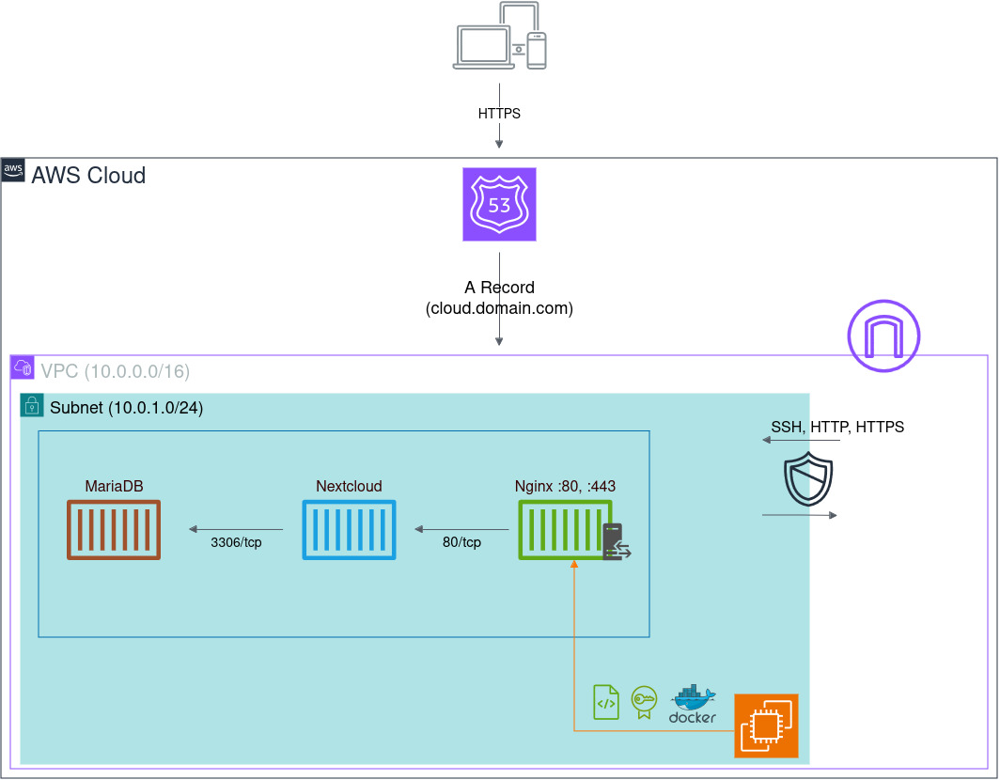

# Nextclound on AWS

## About

This configuration assumes you have access to an AWS account and a CLI user set up, a Route 53 hosted zone readily available, and terraform.
The `init.sh` script will be executed on the EC2 instance once the infrastructure is provisioned. It installs docker, docker-compose, certbot,
generates an SSL certificate, the `nextcloud.conf` and `docker-compose.yaml` files, and writes some environment variables to
`.env.nextcloud` needed for the initial setup.

## Instructions

1. 🧬 Clone this repository and cd into the directory:

```
$ git clone https://github.com/foobarni/nextcloud-aws-tf.git
$ cd nextcloud-aws-tf
```

2. 👬 Create a copy of `template.tfvars` and name it `terraform.tfvars`[^tfvars], then fill in/change the variables for your nextcloud setup.

3. ▶️ Initialize terraform in your directory:

```
$ terraform init
```

4. 📋 Dry run the configuration to see the sketch of the things being created:

```
$ terraform plan
```

5. 🏞️ Proceed to create the resources:

```
$ terraform apply
```

6. ✅ Once terraform finishes, the link to access your Nextcloud and admin credentials will be printed. Please be patient, it may take a minute
for nextcloud to completely set up. It is recommended to change your password once you are logged in.

7. 🌋 Remove any traces of your instance:

```
$ terraform destroy
```

[^tfvars]: Or any other name. When planning, applying or destroying, add the flag `-var-file=name-of.tfvars`

## How it works

The diagram below depicts the infrastructure and the traffic handling of the setup. In this case -- since it is a single EC2 instance
configuration  -- the A record is directly pointing to it. The generated SSL certificate and the server configuration is passed to the
Nginx container, which is set up as a reverse proxy for the Nextcloud app container.


